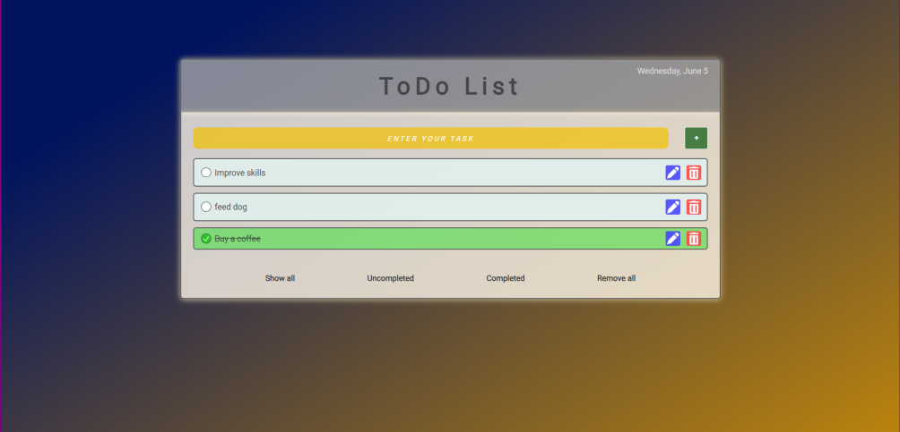
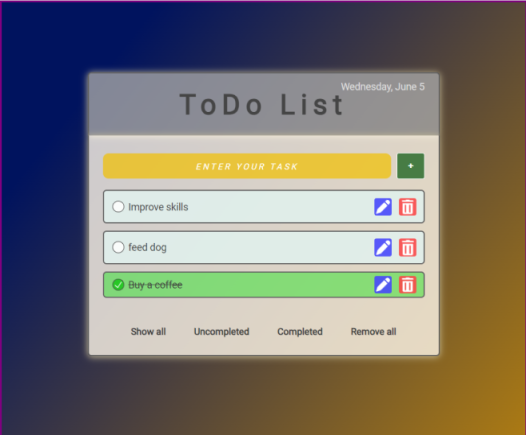
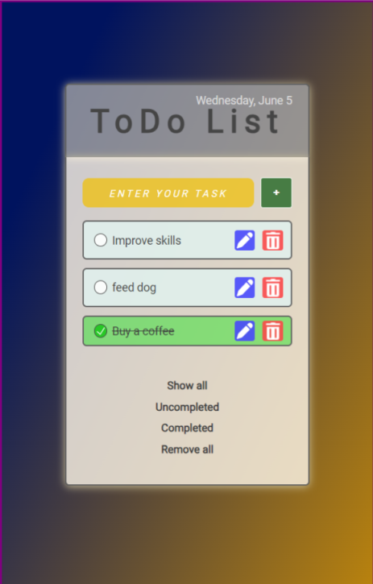

# Simple Todo List

### Description

*This project is web-app, that can create users To-do list.* In the web-app you can create your tasks, sort, edit and remove it, if necessary. 
During the project I used HTML, CSS, Flexbox, JavaScript languages and tools.
This web page is fully adaptive for all devices. Below you can see screenshots of desktop, tablet and mobile versions.

### Preview

 
